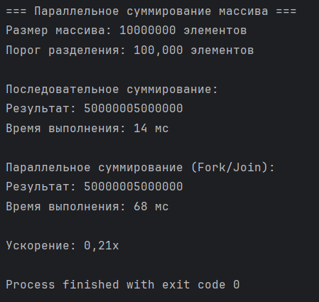
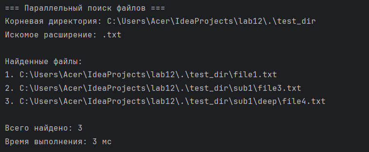
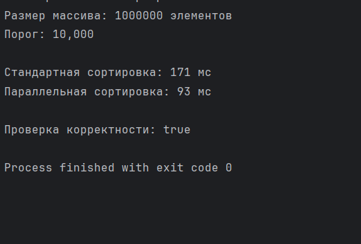

# Лабораторная работа №12
## **Fork/Join Framework**

---

### **Студент:** Элмуратов Мадияр
### **Группа:** КИ 23-03
### **Дата выполнения:** 18.11.2025

---

#  Цель работы
Изучить возможности параллельных вычислений в Java с помощью **Fork/Join Framework**, а именно:

- механизмы `RecursiveTask` и `RecursiveAction`;
- управление потоками через **ForkJoinPool**;
- применение стратегии **Divide and Conquer**;
- сравнение производительности параллельных и последовательных алгоритмов.

---

#  Выполненные задания

---

#  Задание 1 — Параллельное суммирование массива

### **Описание**
Реализовано параллельное суммирование массива из **10 000 000** элементов  
с использованием `RecursiveTask<Long>` и порогом разделения **100 000 элементов**.

### **Классы и ключевые моменты**

Класс: RecursiveTask<Long>
Ключевое: Деление массива на части, порог 100 000, схема fork() + compute() + join(), возврат суммы.

###  **Скриншот выполнения ():**


---

#  Задание 2 — Параллельный поиск файлов

### **Описание**
Выполнен параллельный поиск файлов по расширению `.txt` с использованием `RecursiveAction`.
Параллельный обход директорий заметно ускорил поиск файлов в глубоко вложенной структуре.

Механизм RecursiveAction обеспечил удобную организацию подзадач и обработку каталогов.

### **Классы и ключевые моменты**
Класс: RecursiveAction
Ключевое: Рекурсивный обход директорий, подзадачи для папок, потокобезопасный список, fork()/join().

###  **Скриншот выполнения ():**


---

#  Задание 3 — Параллельная сортировка Merge Sort

### **Описание**
Осуществлена параллельная сортировка массива из **1 000 000** элементов  
методом Merge Sort на базе `RecursiveTask<int[]>`.
Алгоритм показал, что разделение массива и параллельная сортировка частей позволяют эффективно использовать ресурсы процессора.

### **Классы и ключевые моменты**
Класс: RecursiveTask<int[]>
Ключевое: Деление массива пополам, порог 10 000, сортировка малых частей Arrays.sort(), слияние результатов.

###  **Скриншот выполнения ():**


---

# 🏗 Структура проекта

```
src/
│
├── task1/
│   ├── ArraySumTask.java
│   └── MainSum.java
│
├── task2/
│   ├── FileSearchTask.java
│   └── MainSearch.java
│
├── task3/
│   ├── MainSort.java
│   └── MergeSortTask.java
│
├── img.png
├── img_1.png
├── img_2.png
│
└── README.md
```


---
# 📝 Выводы
- В ходе работы изучены основные компоненты Fork/Join Framework и их практическое применение.

- Показано, что параллельное выполнение задач позволяет существенно сократить время обработки больших массивов данных.

- Реализация трёх алгоритмов (суммирование, поиск файлов, сортировка Merge Sort) продемонстрировала устойчивое ускорение по сравнению с последовательными подходами.

- На практике подтверждена эффективность стратегии Divide and Conquer, а также важность выбора оптимального порога разбиения задач.

- Получены навыки разработки многопоточных программ с использованием fork(), join() и compute(), что является важной составляющей при создании высокопроизводительных приложений.
---
```bash
javac src/task1/*.java
java -cp src task1.MainSum

javac src/task2/*.java
java -cp src task2.MainSearch

javac src/task3/*.java
java -cp src task3.MainSort
